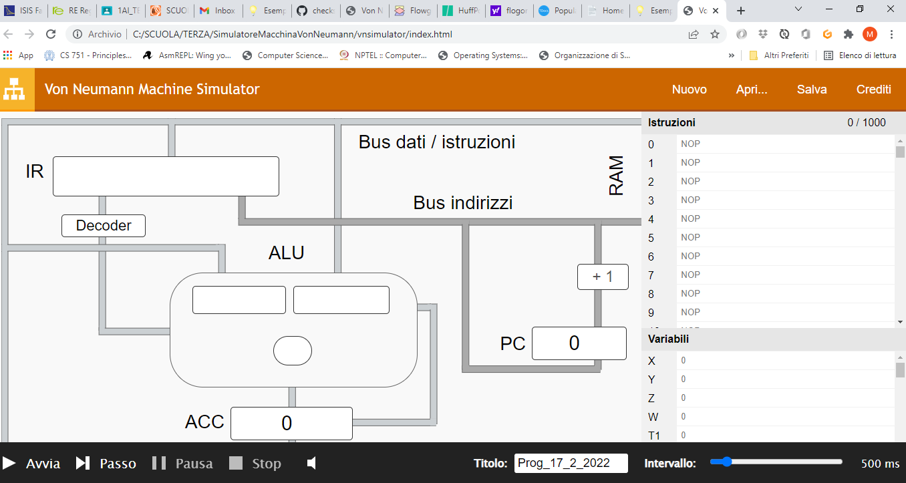
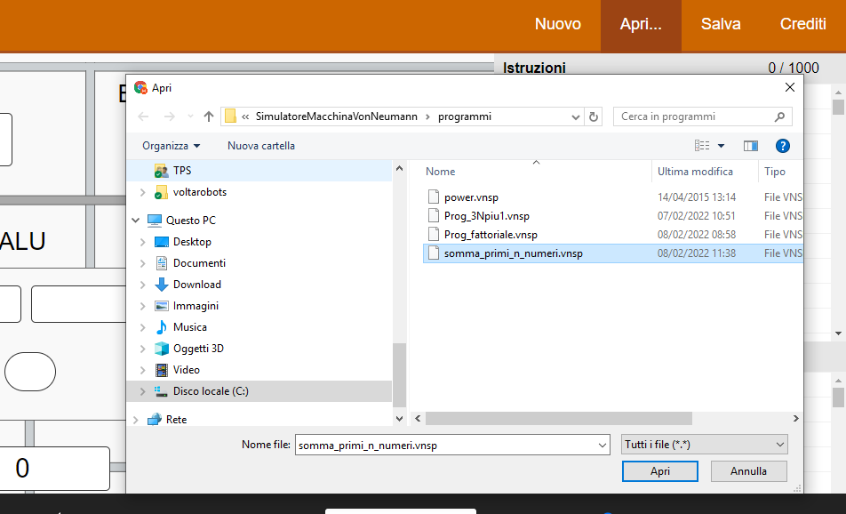
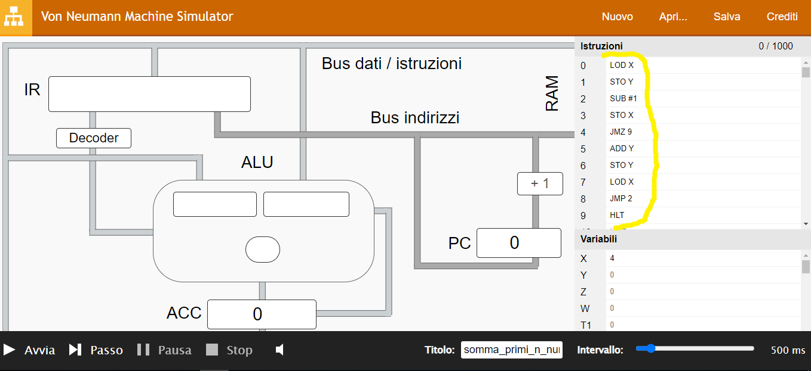
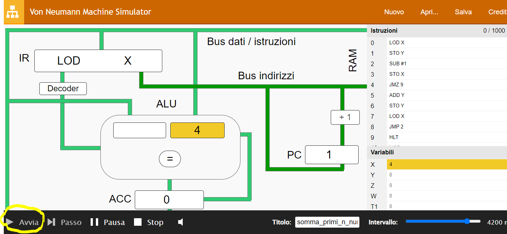

# Von Neumann Machine Simulator

_Simulatore di una Macchina di Von Neumann_ per eseguire il __ciclo fetch-execute__. Questo simulatore, rappresenta una semplice CPU con __program counter__, __instruction register__ e __registro accumulatore__ collegata alla __memoria principale__ tramite __bus dati/istruzioni__ e __bus indirizzi__ che permette l'esecuzione di semplici programmi a scopo didattico.

Vedi [Esempio di architettura computer](https://checksound.gitbook.io/tecnologie3/architettura-computer/esempio-architettura) per le istruzioni accettate dalla CPU del simulatore.

Per utilizzare il simulatore cliccare sul file `./vnsimulator/index.html` e aprirlo con il browser.




Con menù _apri_ è possibile caricare in memoria semplici programmi d'esempio già codificati nella directory `./programmi` per poterli poi eseguire.



Una volta selezionato, il programma è caricato in memoria RAM (evidenziato nella figura sotto in giallo) ed è pronto a questo punto per essere eseguito dalla CPU:



Tramite il pulsante start (evidenziato nella figura sottostante) il programma viene eseguito:




## Elevamento a potenza

Carica il file [programmi/power.vnsp](./programmi/power.vnsp), nella variabile X il valore della base, in Y il valore dell'esponente e in Z il risultato del calcolo. Es: X = -2, Y = 3 --> Z = -8.

Sotto le istruzioni del programma:

```
LOD Y
JMZ 12
LOD X
STO Z
LOD Y
SUB #1
JMZ 14
STO Y
LOD Z
MUL X
STO Z
JMP 4
LOD #1
STO Z
HLT
```

## Calcolo 3N + 1

Il programma [programmi/Prog_3Npiu1.vnsp](./programmi/Prog_3Npiu1.vnsp) determina la metà del numero N, intero positivo,  inizialmente contenuto nella locazione di indirizzo X se esso è pari, altrimenti – se N è dispari – determina il successore del suo triplo e memorizza il risultato nella locazione di indirizzo Y. Se X = 3 --> Y = 3 * 3 + 1 mentre se X = 6 --> Y = 6 / 2 = 3

Sotto le istruzioni con `X` variabile di input e `Z` variabile di output, `Y` è utilizzata come variabile di appoggio:

```
LOD X
DIV #2
MUL #2
STO Y
LOD X
SUB Y
JMZ 11
LOD X
MUL #3
ADD #1
JMP 13
LOD X
DIV #2
STO Z
HALT
```

## Il problema 3N + 1

Dato un numero intero positivo N, definiamo al sequenza '3N + 1' che parte da N come: se N è un numero pari allora dividiamo N per 2; se invece è un numero dispari, allora moltiplichiamo N per 3 e aggiungiamo 1. Continuiamo a generare numeri in questo modo finché N diventa uguale a 1. Per esempio partendo da N = 3, che è dispari, moltiplica per 3 e aggiungi 1, quindi N = N * 3 + 1 = 10. A questo punto, poiché N è pari, va diviso per due, quindi diventa N = 10/2 = 5. Si prosegue in questo modo, fermandoci quando si raggiunge 1. La sequenza completa è: 3, 10, 5, 16, 8, 4, 2, 1

## Somma primi N numeri

Il programma [programmi/somma_primi_n_numeri.vnsp](./programmi/somma_primi_n_numeri.vnsp).

Di seguito le istruzioni, con `X` per numero intero di input e `Y` per il risultato:

```
LOD X 
STO Y 
SUB #1 
STO X 
JMZ 9 
ADD Y 
STO Y 
LOD X 
JMP 2 
HLT
```

## Calcolo fattoriale

Il programma [programmi/Prog_fattoriale.vnsp](./programmi/Prog_fattoriale.vnsp), calcola il fattoriale, di X e inserisce il risultato nella variabile Y. Ad esempio se vogliamo calcolare il fattoriale di 4, 4!, --> 4 * 3 * 2 * 1 = 24.

Il fattoriale di un numero naturale N (in simboli N!) è il prodotto di tutti i numeri naturali compresi tra 1 e N (N incluso); per definizione 0! = 1.

Sotto le istruzioni del programma con `X` variabile di input e `Y` variabile di output:

```
LOD #1
MUL X
STO Y
LOD X
SUB #1
STO X
JMZ 9
LOD Y
JMP 1
HLT
```

## Materiale studio

[ARCHITETTURA COMPUTER](./ARCHITETTURA_COMPUTER.pdf)

### Crediti

Questo simulatore della macchina di Von Neumann è stato realizzato da [Lorenzo Ganni](https://www.linkedin.com/in/lorenzo-ganni-4b4830209/).

Questo file costituisce un'estensione dell'opera di Giorgio Meini, Fiorenzo Formichi, 'Tecnologie e progettazione di sistemi informatici e di telecomunicazioni'.

© Zanichelli Editore S.p.A., 2015
